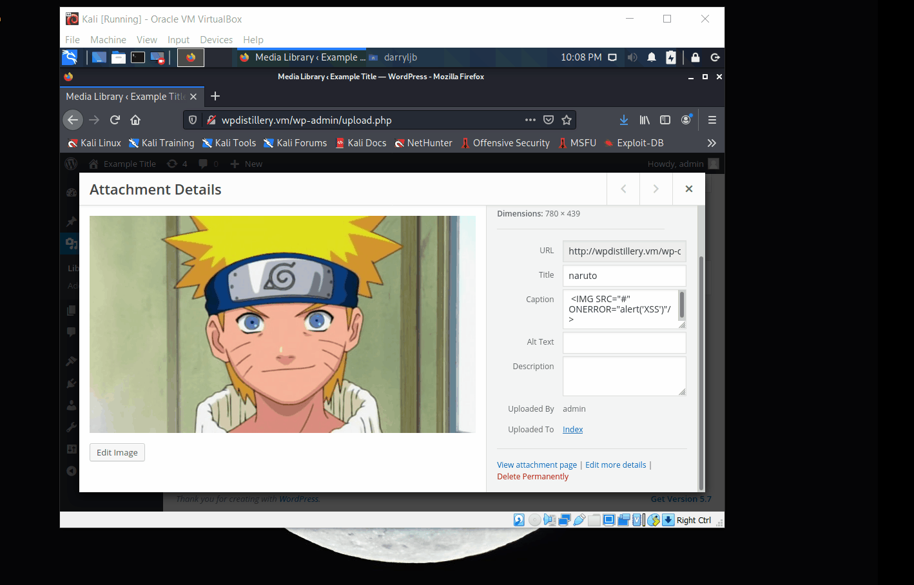
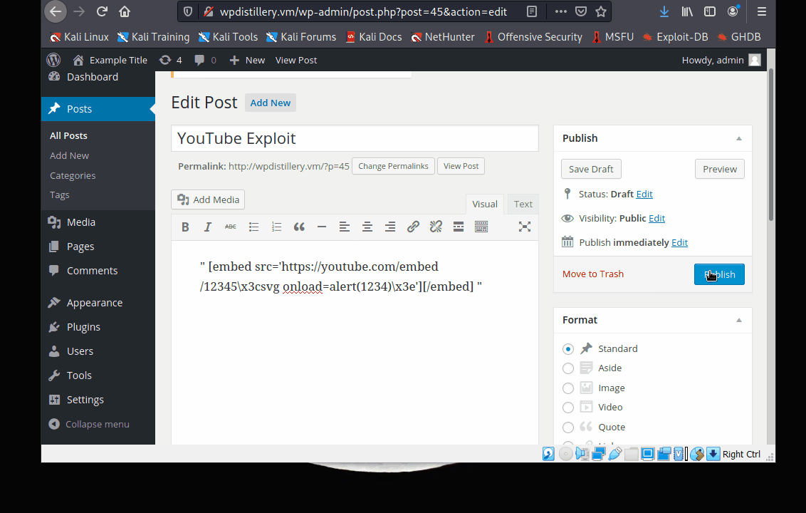

# Project 7 - WordPress Pentesting

Time spent: **X** hours spent in total

> Objective: Find, analyze, recreate, and document **five vulnerabilities** affecting an old version of WordPress

## Pentesting Report

### 1. (Required) Comment Cross-Site Scripting/CVE-2019-9787 
  - [ ] Summary: Media post comment section and caption section allows for XSS attack.  
    - Vulnerability types: XSS
    - Tested in version: 3.9
    - Fixed in version: 5.1.1 
  - [ ] GIF Walkthrough: 

  - [ ] Steps to recreate: Login as admin. Create media post and upload a picture. Edit the comment or caption file with this script: "".
  - [ ] Affected source code:
    - [Link 1](https://github.com/WordPress/WordPress/commit/0292de60ec78c5a44956765189403654fe4d080b)
### 2. (Required) Vulnerability Name or ID
  - [ ] Summary: WordPress 4.0-4.7.2 - Authenticated Stored Cross-Site Scripting (XSS) in YouTube URL Embeds/CVE-2015-6535
    - Vulnerability types: XSS vulnerability using embed Youtube url shortcode. 
    - Tested in version: 4.2.2
    - Fixed in version: 4.2.13
  - [ ] GIF Walkthrough:  
  - [ ] Steps to recreate: Create new post. Embed a youtube link within the text box, replacing "<" and ">" with "\x3c" and "\x3e".
  - [ ] Affected source code:
    - [Link 1](https://github.com/WordPress/WordPress/commit/419c8d97ce8df7d5004ee0b566bc5e095f0a6ca8)
### 3. (Required) Vulnerability Name or ID
  - [ ] Summary: 
    - Vulnerability types:
    - Tested in version:
    - Fixed in version: 
  - [ ] GIF Walkthrough: 
  - [ ] Steps to recreate: 
  - [ ] Affected source code:
    - [Link 1](https://core.trac.wordpress.org/browser/tags/version/src/source_file.php)
### 4. (Optional) Vulnerability Name or ID
  - [ ] Summary: 
    - Vulnerability types:
    - Tested in version:
    - Fixed in version: 
  - [ ] GIF Walkthrough: 
  - [ ] Steps to recreate: 
  - [ ] Affected source code:
    - [Link 1](https://core.trac.wordpress.org/browser/tags/version/src/source_file.php)
### 5. (Optional) Vulnerability Name or ID
  - [ ] Summary: 
    - Vulnerability types:
    - Tested in version:
    - Fixed in version: 
  - [ ] GIF Walkthrough: 
  - [ ] Steps to recreate: 
  - [ ] Affected source code:
    - [Link 1](https://core.trac.wordpress.org/browser/tags/version/src/source_file.php) 

## Assets

List any additional assets, such as scripts or files

## Resources

- [WordPress Source Browser](https://core.trac.wordpress.org/browser/)
- [WordPress Developer Reference](https://developer.wordpress.org/reference/)

GIFs created with [LiceCap](http://www.cockos.com/licecap/).

## Notes

Describe any challenges encountered while doing the work

## License

    Copyright [yyyy] [name of copyright owner]

    Licensed under the Apache License, Version 2.0 (the "License");
    you may not use this file except in compliance with the License.
    You may obtain a copy of the License at

        http://www.apache.org/licenses/LICENSE-2.0

    Unless required by applicable law or agreed to in writing, software
    distributed under the License is distributed on an "AS IS" BASIS,
    WITHOUT WARRANTIES OR CONDITIONS OF ANY KIND, either express or implied.
    See the License for the specific language governing permissions and
    limitations under the License.
